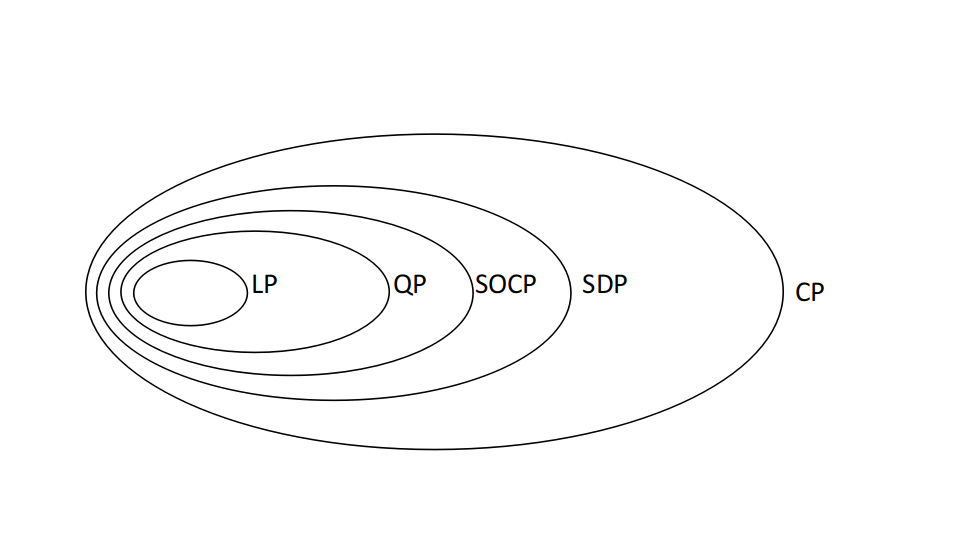
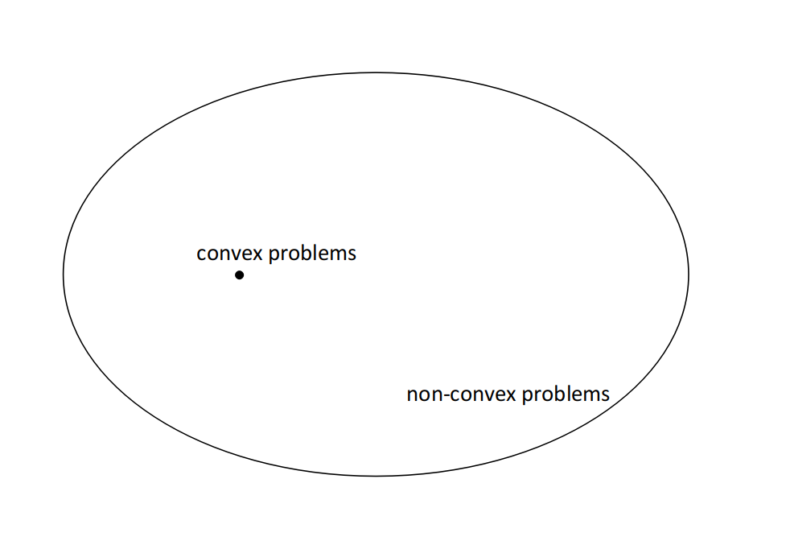

# 典型问题形式

> 凸优化问题可以被分为下面几种形式：
  - 线性规划(LP)
  - 二次规划(QP)
  - 半定规划(SDP)
  - 锥规划(CP)

## 线性规划(Linear Programs)

### 定义

一个线性规划(LP)是如下的凸优化形式：
$$
\begin{split}
\min_x \ & c^Tx\\
s.t.\ \ & Dx \leq d\\
& Ax=b\\
\end{split}
$$

这个形式总是凸的，也是在凸优化问题中一个重要的问题，它有很多的应用和丰富的历史。有很多线性规划的例子，就不一一写了。

### 标准形式

一个线性规划问题可以写成如下标准形式，任意的LP都可以改写成标准形式：
$$
\begin{split}
\min_x \ & c^Tx\\
s.t\ \ & Ax=b\\
&x \geq 0\\
\end{split}
$$

## 二次规划(Quadratic Programs)

### 定义

一个凸二次规划问题(QP)是如下形式的：
$$
\begin{split}
\min_x \ & c^Tx+\frac{1}{2}x^TQx\\
s.t.\ \ & Dx \leq d\\
& Ax = b\\ 
\end{split}
$$
一般情况下只会讨论$$Q\succeq 0$$因为当且仅当这个时候这个问题才是凸优化问题。

一些常见的的QP问题有Portfolio优化、支持向量机、Lasso等。

### 标准形式

任何的QP可以重写成标准形式：
$$
\begin{split}
\min_x \ & c^Tx + \frac{1}{2}x^TQx\\
s.t\ \ & Ax=b\\
&x \geq 0\\
\end{split}
$$

## 半定规划(Semidefinite programs, SPDs)

### 背景

在线性规划中，x是一个向量，但是我们会有在矩阵上优化的问题。

回忆：

- $$\mathbb{S}^n$$是$$n \times n$$对称矩阵空间
- $$\mathbb{S}_+^n$$是正半定矩阵空间：
$$
\mathbb{S}_+^n = \{X \in \mathbb{S}^n|u^TXu \geq 0\ for\ all\ u \in \mathbb{R}^n\}
$$
- $$S_{++}^n$$是正定矩阵空间：
$$
\mathbb{S}_{++}^n = \{X \in \mathbb{S}^n|u^TXu \ge 0\ for\ all\ u \in \mathbb{R}^n\}
$$

如果X是上述集合的一个矩阵，它的特征值$$\lambda(X)$$也受这个矩阵约束，比如正半定矩阵的特征值大于等于0，而正定矩阵的特征值大于0。

两个对称矩阵$$X,Y \in \mathbb{S}^n$$的内积可以用迹操作求得：
$$
X \bullet Y = tr(XY) = \sum_{i,j}X_{i,j}Y_{i,j}
$$

我们可以定义一种偏序$$\succeq$$如下：
$$
X \succeq Y \Leftrightarrow X - Y \in \mathbb{R}_+^n
$$

考虑对角矩阵，这种矩阵的排序就和向量的排序变得一样了，如下，diag(x)表示一个矩阵$$X \in \mathbb{S}^n$$，它的对角线上的元素组成了向量$$x \in \mathbb{S}^n$$，当$$x,y \in \mathbb{S}^n$$：
$$
diag(x) \succeq diag(y) \Leftrightarrow x \geq y
$$

### 定义

一个SDP优化问题可以写成如下形式：
$$
\begin{split}
\min_{X \in \mathbb{S}^n} \ & C \bullet X\\
s.t.\ \ & x_1F_1+\cdots+x_nF_n \preceq F_0\\
& Ax=b\\
\end{split}
$$

其中$$F_j \in \mathbb{S}^d,\ j=0,1,\cdots,n；\ c \in \mathbb{S}^{m\times n};\ c \in \mathbb{S}^n;\ b \in \mathbb{S}^m$$。这个形式和线性规划的形式很相似。在线性规划中，约束条件是$$Dx \leq d$$，如果我们使$$D_i$$成为D的第i列,那么这个约束条件等于$$\sum_ix_iDi \leq d$$。在SDP中，它简单地将向量$$D_i$$和d变成了对称矩阵$$F_i$$

### 标准形式

$$
\begin{split}
\min_{X \in \mathbb{S}^n} \ & C \bullet X\\
s.t.\ \ & A_i \bullet X = b_i,\ i=1,\cdots,m\\
& X \succeq 0\\
\end{split}
$$

一个线性规划也是一个半定规划，只要在半定规划中使$$X = diag(x)$$

## 锥规划(Conic Programs)

### 定义

一个锥规划(CP)问题有如下形式:
$$
\begin{split}
\min_x \ & c^Tx\\
s.t.\ \ & Ax = b\\
& D(x) + b \in K\\
\end{split}
$$
这里，$$c,x \in \mathbb{R}^n,\ A \in \mathbb{R}^{m \times n},\ b \in \mathbb{R}^m$$,而$$D:\mathbb{R}^n \rightarrow Y$$是欧式空间的一个线性映射，$$d \in Y$$，$$K \subseteq Y$$是一个封闭的凸锥。

可以证明锥规划问题包含了上述的几个种类的问题。

Second-Order Cone Program是锥规划问题的一个例子。不详细写了。

## 规划问题间的关系

上述几种问题之间的关系如下：

而凸优化问题只是所有优化问题的中的沧海一粟：
