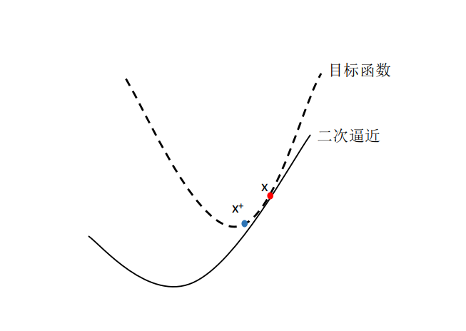
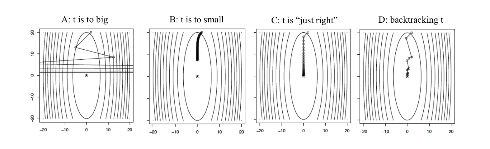

# 梯度下降

> 本文内容包括:梯度下降算法算法内容和收敛性分析，算法步长选择，梯度提升与随机梯度下降。

## 梯度下降算法

梯度下降算法是在机器学习和深度学习中应用得十分广泛的算法，了解方向导数，方向余弦，偏导数等数学概念可能会有利于学习这个算法。

$$f(x)$$是凸函数且在$$dom(f)=R^n$$上是可微的。将最优的目标函数表示为$$f^* = min_x f(x)$$，解表示为$$x^*$$，考虑一个无约束的光滑凸函数优化问题：
$$
\min_x f(x)
$$

**梯度下降（Gradient descent）**：选择初始点$$x^{(0)} \in \mathbb{R}^n$$，重复：
$$
x^{(k)} = x^{(k-1)} - t_k \cdot {\nabla f(x^{(k-1)})}, k = 1,2,3,\cdots
$$
直至在某个点停止。

### 如何理解梯度下降算法

简单的说，可以将梯度下降算法看做是持续重复地下山，负梯度的方向是降低优化目标函数的方向，那么x沿着负梯度的方向移动一定距离，那么相应的目标函数值就会减少一些，对于凸优化问题来说，不论我们的出发点在哪里，我们总会在最优解附近的某一个点停下来；而对于非凸优化问题，对于不同的出发点，我们可能到达不同的局部最优解。

更进一步地，我们可以将梯度下降算法解释为一个**二次近似(Quadratic approximation)**。假设我们在点x,对f(y)做二次泰勒展开：
$$
f(y) \approx f(x) + \nabla f(x)^T\cdot (y-x) + \frac{1}{2}\nabla^2f(x)\left\|y-x\right\|^2_2
$$

将Hessian$$\nabla^2 f(x)$$替换为$$\frac{1}{t}I$$，那么$$f(x) + \nabla f(x)^T(y-x)$$为f的线性逼近，而$$\frac{1}{2f}\left\|y-x\right\|^2_2$$，权重为$$\frac{1}{2t}$$的一个惩罚项，**当t越小时，惩罚项却会越大，我们就离开当前x，需要花掉更大的代价(所以在选取步长t时，需要一定的技巧)**。这两项，共同构成了f(y)的二次逼近。

梯度下降实际上是在每一步最小化这个二次逼近。
$$
\begin{align}
min_y f(y) &= min_y \left\{ f(x) +  \nabla f(x)\cdot (y-x)  + \frac{1}{2t}\left\|y - x\right\|_2^2 \right\} \\
&= min_y \left\{  \nabla f(x)\cdot y  + \frac{1}{2t}\left\|y - x\right\|_2^2 \right\} & \text{去除与y无关的项}\\
&= min_y \left\{ 2t \nabla f(x) \cdot y + \left\|y - x\right\|_2^2 \right\} & \text{乘以2t}\\
&= min_y \left\{ 2t \nabla f(x) \cdot y + \left\|y\right\|_2^2 - 2 x\cdot y  + \left\|x\right\|^2_2 \right\} & \text{展开}\\
&= min_y \left\{ \left\|y - (x - t\nabla f(x))\right\| \right\} & \text{化简，忽略无关项}
\end{align}
$$
为了最小化这个二次逼近，选取$$y = x^+$$：
$$
x^+ = x - t\nabla f(x) 
$$

## 步长选择

### 固定步长

最简单的方法是找到一个步长，在所有的迭代过程中，固定步长。但是这样做，是需要一定的技巧与经验的，因为太小的步长会导致迭代过慢，相反，太大的步长可能会导致算法无法收敛。

### 回溯线搜索(Backtracking line search)

通过动态的选择步长是可以的，Backtracking line search就是其中的一种方法，其过程如下：

- 首先固定参数：$$0 \le \beta \le 1,\ 0 \le \alpha \le \frac{1}{2}$$
- 在迭代的每一步，以$$t=t_{init}$$开始，当：
$$
f(x-t\nabla f(x)) \ge f(x) - \alpha t \left\| \nabla f(x) \right\|_2^2
$$
时，缩小$$t = \beta t$$。否则，进行梯度下降更新：
$$
x^+ = x -t \nabla f(x)
$$

这样做不仅简单，而且在实际应用中表现得很好，进一步简化可以使$$\alpha = 1/2$$

### Exact line search 

也可以选择能够沿着扶梯度方向降低的最优步长，被称为exact line search：
$$
t = \underset{s \geq 0}{\operatorname{argmin}} f(x - s\nabla f(x))
$$
这样做几乎不可能选出合适的步长，因为它消耗的资源比前一种方法更多，并不值得。

## 收敛性分析

**Lipschitz continuous**:假设f是可微的凸函数，在$$dom(f) = \mathbb{R}^n$$，对于任意x,y:
$$
\left\| \nabla f(x) - \nabla f(y)\right\|_2 \leq L\left\|x -y \right\|_2
$$
即$$\nabla f$$是Lipschitz连续的，$$L \ge 0$$。(在证明凸优化算法的收敛性时，这是一个很有用的定理)

**假设下面的所有的f都满足上述性质。**

**定理：**对于梯度下降，固定的步长$$t \leq \frac{1}{L}$$满足：
$$
f(x^{(k)}) - f^* \leq \frac{\left\|x^{(0)} - x^*\right\|_2^2}{2tk}
$$
我们称梯度下降的收敛率为$$O(1/k)$$，即为了使$$f(x^{(k)}) - f^* \leq \epsilon$$，需要$$O(1/\epsilon)$$次迭代。

/*TODO:具体证明，以后来填坑*/

### 特殊情况下的收敛性

#### backtracking
**定理：**对于步长通过backtracking line search获得的，梯度下降满足：
$$
f(x^{(k)}) - f^* \leq \frac{\left\|x^{(0)} - x^*\right\|_2^2}{2t_{min}k},\ 其中t_{min} = \min \{1, \beta/L\}
$$

#### 强凸函数的收敛性

具有强凸性质的函数，在满足Lipschitz连续假设的情况下：
**定理：**对于梯度下降，固定的步长$$t \leq \frac{2}{m+L}$$，或者通过backtracking line search获得步长，满足：
$$
f(x^{(k)}) - f^* \leq c^k\frac{L}{2}{\left\|x^{(0)} - x^*\right\|_2^2}，\ 其中0 < c < 1
$$
即强凸函数的收敛率为$$O(c^k)$$,为指数级的，即为了使$$f(x^{(k)}) - f^* \leq \epsilon$$，需要$$O(\log (1/\epsilon))$$次迭代。

## 实践技巧

停机准则：当$$\left\|\nabla f(x)\right\|_2$$足够小时停止迭代。

- 在最优解$$x^*$$处$$\nabla f(x^*) = 0$$
- 如果f是强凸函数，参数为m，有：
$$
\left\|\nabla f(x)\right\| \leq \sqrt{2m\epsilon} \Rightarrow f(x) - f^* \leq \epsilon
$$

优点：

- 简单，每次迭代代价相对较小
- 对于有良好条件的强凸问题速度很快

缺点：

- 一般情况下收敛速度并不快
- 不能解决不可微的函数

## 扩展

### 梯度提升(Gradient Boosting)

梯度提升是梯度下降与树相结合的一种方法。假设观测值$$y=(y_1, \cdots, y_n) \in R^n$$， 预测器$$x_i \in R^p, i=1,\cdots,n$$。我们想基于我们的预测器构建一个非线性的模型。

我们定义树的加权和如下：
$$
u_i = \sum_{j=1}^m \beta_j \cdot T_j(x_i),\ i=1,\cdots, n
$$

每一个树$$T_j$$将一个预测器$$x_i$$作为输出并输出一个预测值。在这种设定下，选择一个损失函数L，例如在y连续时，我们可以选择$$L(y_i, u_i)=(y_i -u_i)^2$$，于是，问题转变为：
$$
\min \limits_{\beta} \sum_{i=1}^n L\left( y_i, \sum_{j=1}^M \beta_j \cdot T_j(x_i) \right)
$$

将这个优化问题想象成$$min_u f(u)$$，这个算法的执行情况如下：

从一个初始的模型（一个简单的树$$u^{(0)} = T_0$$）开始，重复：

1. 计算上一次预测$$u^{k-1}$$的负梯度d，
$$
d_i = - \left[ \frac{\partial L(y_i, u_i)}{\partial u_i}\right]\bigg|_{u_i=u_i^{(k-1)}}, i=1,\cdots,n
$$
2. 寻找一个树接近d，也就是说：
$$
\min \limits_{trees T} \sum_{i = 1}^n (d_i - T(x_i))^2
$$

3. 计算步长$$\alpha_k$$,更新我们的预测值：
$$
u^{(k)} = u^{(k-1)} + \alpha_k \cdot T_k
$$

### 随机梯度下降(Stochastic Gradient Descent)

考虑最小化函数的加和：
$$
\min \limits_{x} \sum_{i=1}^m f_i(x)
$$

梯度下降迭代计算：
$$
x^{(k)} = x^{(k-1)} - t_k \cdot \sum_{i=1}^m \nabla f_i(x^{(k-1)}), k=1,2,3,\cdots
$$

随机梯度下降（SGD）迭代计算：
$$
x^{(k)} = x^{(k-1)} - t_k \cdot \nabla f_{i_k}(x^{(k-1)}), k=1,2,3,\cdots
$$

其中$$i_k \in \{1, \cdots, m\}$$是在第k次迭代的时候选择的指数。

有两种规则可以选择$$i_k$$:

- **循环的方法**：选择$$i_k =1,2,3,\cdots,m,1,2,3,\cdots,m$$

- **随机的选择**：通过随机的方式选择$$i_k \in \{1,\cdots, m\}$$，在实际应用中选择这种方式更多。

可以证明SGD算法在$$\nabla f_i(x)$$不随x剧烈变化时是收敛的。