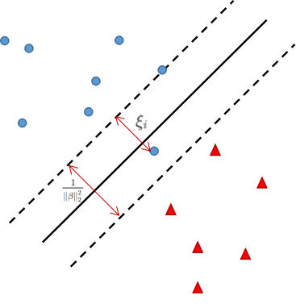

# 优化基础

> 本文包括了凸优化的术语，凸解集，支持向量机的凸优化问题，局部优化，变量的变换与改变，消除等式约束，引入松弛变量等凸优化问题的转化，把PCA写成凸优化问题。

## 术语

我们定义一个凸优化问题如下:
$$
\begin{split}
\min \limits_{x \in D} \quad & f(x)\\
subject\ to\ \quad & g_i(x) \leq 0, i = 1, \cdots,m；\\
& Ax=b\\
\end{split}
$$

其中目标函数，$${\mit f}$$,和不等的约束函数，$${\mit g_i}$$，都是凸函数，同样，等式约束是线性的。以及，定义域是$$D = dom(f) \cap \bigcap_{i=1}^m dom(g_i)$$。

凸优化涉及到的术语如下：

- $${\mit f}$$:目标函数(objective/criterion function)
- $${\mit g}$$:约束条件(inequality constaraint functions)
- $${\mit x}$$可行解(feasible point):任何满足优化问题的约束条件的$${\mit x}$$
- $${\mit f^*}$$最优值(optimal value):所有可行解中,目标函数的最小值
- $${\mit x^*}$$最优解(optimal/solution)：$$if\ x^* \in x\ s.t.\ f(x^*)=f^*$$
- $$\epsilon-suboptimal$$解：满足$$f(x) \leq f^* + \epsilon$$ 的可行解

如果$${\mit x}$$是可行解且$$g_i(x) = 0$$，则$$g_i$$在$${\mit x}$$ 处是活跃的(active)，而如果$$g_i(x) \le = 0$$，则$$g_i$$在$${\mit x}$$ 处是待用的(inactive)。

任何凸函数的最小化都可以转换成一个凹函数的最大化，反之依然。这是因为，在约束条件下最小化$$f(x)$$，等于在相同的约束条件下最大化$$- f(x)$$，他们具有相同的解。

## 凸解集

如果$$X_{opt}$$是一个凸优化问题的所有最优解的集合，它可以被表达为：
$$
\begin{split}
X_{opt}= \quad argmin \quad & f(x)\\
subject\ to\ \quad & g_i(x) \leq 0, i = 1, \cdots,m\\
& Ax=b\\
\end{split}
$$

那么这样的一个最优解集是否是凸集呢？可以通过考虑两个最优解x,y来验证其凸性质。对于$$0 \leq t \leq 1,\ tx+(1-y)y \in D$$，由于x,y满足不等和相等约束：
$$
f(tx+(1-t)y) \leq tf(x) + (1-t)f(y) = tf^* + (1-t)f^* = f^*
$$
所以$$tx + (1-t)y$$也是一个最优解，$$X_{opt}$$是一个凸集。但是$$X_{opt}$$是凸集，不意味它是唯一的。也就是说，即使一个局部最优解就是全局最小，一个凸优化问题的解仍然有很多。这些优化问题可能有零个，一个和无数多个解。如果凸函数具有严格凸性质，那么它只有唯一的解。

### 例子：Lasso

Lasso是一个在机器学习和统计学中十分常见的问题，它是一个回归问题。

给定$$y \in R^n$$，且$$x \in R^{n*p}$$，一个Lasso问题可以公式化为：
$$
\begin{split}
\min_{\beta} \ & \left\|y -X\beta\right\|_2^2\\
subject\ to \ & \left\|\beta\right\|_1 \leq s\\
\end{split}
$$

Lasso 是一个凸优化问题因为目标函数是一个最小二乘损失的凸函数，而且它的越是一个范数小于一个常数，而它也是凸的。这个问题只有一个不等式约束，$$g_i(x) = \left\|\beta\right\|_1 -s$$，没有等式约束。可行解集是满足L1-范数球的$$\beta \in R^p$$。

- $$n \geq p$$, X 满秩：这样$$\nabla^2f(\beta)=2X^TX$$，给定X是满秩 $$\Rightarrow$$ $$X^TX$$是不可逆的 $$\Rightarrow$$ $$X^TX$$是正定的。因此，$$\nabla^2f(\beta) \ge 0$$，在这种情况下最优解是唯一的因为严格凸函数只有一个最优解。

- $$p \ge n$$(高维)情况：在这种情况下，$$X^TX$$是奇异的。$$f(\beta)= \beta^TX^TX\beta - 2y^TX\beta + y^Ty$$，对于一些$$\beta \not= 0 且X\beta = 0$$，我们得到$$\beta^TX^TX\beta=0$$。这意味着$$f(\beta)$$是线性的。因此，我们得到多个解而且不能保证有唯一解。

如果一个函数f是严格凸函数，这意味着解的唯一性，否则我们不能保证唯一性。

### 例子：支持向量机

支持向量机是一种解决分类问题的机器学习算法，一般用于解决线性可分的二分类问题，在加入了核函数之后，也可以用于非线性可分的问题。

给定标签$$y \in \{-1,1\}^n$$和特征$$X \in R^{n \times p},\ 行向量x_1, \cdots, x_n$$,有两个变量($$\beta和\xi$$)，$$\frac{1}{\left\|\beta\right\|_2^2}$$是分类的虚线边界的聚义，$$\xi_i$$为分类错误的代价，代表分错的样本点到正确分类边界的距离，间距$$\beta_0$$是单维度的参数，C是一个选择的参数，SVM的目标函数是：
$$
\min_{\beta,\beta_0, \xi} \frac{1}{2}\left\|\beta\right\|_2^2 + C \sum_{i=1}^n \xi_i
$$

它的优化约束是：
$$
\xi_i \geq 0, i=1, \cdots, n
$$
$$
y_i(x_i^T\beta + \beta_0) \geq 1 - \xi_i, i =1,\cdots,n
$$

这个问题是凸优化问题，因为目标函数仅仅是一个二次加一个线性函数（凸函数）,我们可以重写$$-\xi_i \leq 0$$，是一个仿射函数，同样我们可以重写第二个不等式约束$$-y_i(x_i^T\beta + \beta_0) +1 -\xi_i \leq 0$$。

这个问题不是严格凸的因为目标函数是$$\xi$$的一个线性函数。因此，我们不能说它有唯一的最优解。

**特殊情况**：如果我们固定其他变量，只看$$\beta$$组分，它决定分割的超平面的位置，那么目标函数就是一个严格凸函数，就有唯一解。

## 重写约束

针对凸优化问题，在不失概括性的情况下，我们可以将约束封装在集合C中，

根据$$x \in C$$，其中$$C = \{x:g_i(x) \leq 0, i=1,\cdots, m; Ax=b\}, the\ feasible\ set\ $$。说$$x \in C$$也就是说在C中描述的约束都满足。更进一步，我们可以用C的指示函数$$I_C$$来重写凸优化问题：
$$
\min_x f(x)+I_C(x)
$$
这个指示函数$$I_C$$当$$x \in C$$时，等于0，当$$x \notin C$$，等于无限。当C为凸集时，只是函数是一个凸函数。利用凸函数的定义，如果$$g_i(x)$$为凸函数，那么$$g_i(x) \leq 0$$为凸集。而对于所有的i来说，都有$$g_i(x) \leq 0$$，是凸集的intersection。因此C是由凸约束构成的凸集：
$$
C = \cap_{i=1}^m\{x:g_(x) \leq 0\}\cap\{x:Ax=b\}
$$

## 一阶最优性

一阶最优性(first-order optimality)是凸函数的充要条件，这描述同样使用于凸优化问题。
$$
\begin{split}
\min_x \ & f(x)\\
subject\ to\ & x \in C\\
\end{split}
$$
令f为可微的，那么一个可行点是最优点的充要条件是：
$$
\nabla f(x)^T(y-x) \geq 0,\ for\ all\ y \in C.
$$
x的所有可行的方向与梯度一致。

**解释**:假设你在一个可行点x，你打算移动到另一个可行点y,如果从x到y的向量与梯度一致，如果对于所有的y,x到他们的梯度都是正的，那么x就是最优解。相当于，你站在山谷的一个点上，你向四周爬都是在向上爬，那么你站的点就是最低点。

**特殊情况**：$$C = R^n$$时，就是没有约束的优化(全局)，当尝试最小化一个凸的光滑函数f时，这个最优解必定在梯度为0的地方。

### 例子：quadratic minimization

考虑最小化：
$$
f(x) = \frac{1}{2}x^TQx + b^Tx + c，\ where\ Q \geq 0.
$$
它的一阶条件显示最优解满足：
$$
\nabla f(x)= Qx + b = 0
$$
根据Q的不同有三种可能的最优解的情况：
- 如果$$Q \geq 0$$如正定的，那么有一个唯一解$$x = -Q^{-1}b$$
- 如果Q是奇异的，如不可逆，且$$b \notin col(Q)$$，那么无解
- 如果Q是奇异的，如不可逆，且$$b \in col(Q)$$，那么有无限多个解，解的形式是$$x = Q^+b + z, 其中z \in null(Q),且Q^+是Q的伪逆$$

## 局部优化

通常可以局部优化一个凸优化问题而且保持凸性质。

这基于一个事实，即只要最小化的集合是凸的，我们就可以总是将函数局部最小化到某些变量上。

通常地：$$g(x) = \min_{y \in C}f(x,y)$$，f在(x,y)上是凸函数，并且C是凸集。

例如，如果我们分解x,$$x=(x_1, x_2) \in R^{n_1 + n_2}$$：
$$
\begin{split}
\min_{x_1,x_2} \ & f(x1,x2)\\
s.t.\ \ & g_1(x_1) \leq 0\ , g_2(x_2) \leq 0\\
\end{split}
$$
在局部上，我们同样可以：
$$
\begin{split}
\min_{x_1} \ & \tilde{f}(x_1)\\
s.t.\ \ & g_1(x_1) \leq 0,\ where\ \tilde{f}(x_1)=\min\{f(x_1, x_2):g_2(x_2) \leq 0\}\\
\end{split}
$$
如果第一个问题是凸的，那么第二个问题也是凸的。

### 例子：hinge form of SVMs

可以将前面的SVM改写：

首先重写约束条件为$$0 \leq \xi_i，\ 1 - y_i(x_i^T\beta+\beta_0) \leq \xi_i$$或者$$\xi_i \geq \max\{0, 1-y_i(x_i^T\beta + \beta_0)\}$$。这个不等式在优化时通常是大于，只有在最优解的时候为等于。这意味着我们可以最小话$$\xi_i$$应为我们已经知道了在最优解时的情况：$$\xi_i=\max\{0, 1-y_i(x_i^T\beta+\beta_0)\}$$。

因此插入最优的$$\xi$$我们可以重写这个问题：
$$
\min_{\beta,\beta_0}\frac{1}{2}\left\|\beta\right\|_2^2 + C\sum_{i=1}^n[1-y_i(x_i^T\beta + \beta_0)]_+
$$
其中$$a_+ = \max\{0, a\}$$被成为hinge function。

## 变量的变换与改变

- **变换(transforming variables)**

如果$$h:R \rightarrow R$$是单调递增的变换，
$$
\min_x f(x)\ s.t.\ x \in C \Leftrightarrow \min_x h(f(x))\ s.t.\ x \in C
$$
相似地，不等式和等式约束可以被转换并产生相同的优化问题。我们在统计学上经常遇到这种，比如我们经常用对数似然函数替代似然函数因为log函数是单调递增的。可以利用变换来解决一些隐藏的凸优化问题。

- **改变(changing variables)**

如果$$\phi:R^n \rightarrow R^m$$是一对一的，且它的图像包含了可行解集C.
$$
\min_x f(x) s.t.\ x \in C \Leftrightarrow \min_y f(\phi(y))\ s.t.\ \phi(y) \in C
$$

## 消除等式约束

如果一个问题可以写成一个标准的凸优化形式：
$$
\begin{split}
\min \limits_{x \in D} \quad & f(x)\\
subject\ to\ \quad & g_i(x) \leq 0, i = 1, \cdots,m；\\
& Ax=b\\
\end{split}
$$
那么，x可以表示为$$My+x_0(where\ Ax_0 =b\ and\ col(M) = null(A) )$$。这样做可以使我们的重写上述问题为：
$$
\begin{split}
\min \ & f(My +x_0)\\
s.t.\ \ & g_i(My +x_0) \leq 0, i=1,\cdots,m\\
\end{split}
$$

## 引入松弛变量

松弛变量的概念与消除等式约束完全相反，因此凸优化可以写成：
$$
\begin{split}
\min \limits_{x，s} \quad & f(x)\\
subject\ to\ \quad & s_i \geq 0, i = 1, \cdots,m；\\
& g_i(x) + s_i = 0, i =1, \cdots,m;\\
& Ax=b\\
\end{split}
$$

这个问题不是凸优化问题除非$$g_i$$全是仿射的（affine）

## 放宽非仿射等式约束

给定一个优化问题$$\min_xf(x),\ x \in C$$，我们可以考虑把C放大，$$\tilde{C} \supseteq C$$，然后最小化$$\min_xf(x),\ x \in \tilde{C}$$。这种方法被称为relaxation，新问题的最优解通常小于或者等于原问题的最优解。

一个重要的特殊情况是将所有的凸非仿射等式约束$$h_j(x)=0, j=1,\cdots,r$$用$$h_j(x) \leq 0, j=1,\cdots, m$$取代。

### 例子：最大效用问题

最大效用问题(maximum utility problem)是投资/消费等问题的模型，它可以被公式化为：
$$
\begin{split}
& \max_{x,b} \sum_{t=1}^T\alpha_tu(x_t)\\
s.t.\ \ & b_{t+1} = b_t + f(b_t) -x_t, t=1, \cdots, T\\
& 0 \leq x_t \leq b_t, t=1, \cdots, T\\
\end{split}
$$
其中$$b_t$$为预算，$$x_t$$为时间t的消费总数，f是投资返回函数，u为效用函数，它们都是凹的，且是增加的。这个等式约束不是仿射的，但是我们可以将它松弛成一个不等式约束(等号变小于等于)，这个问题就是凸优化问题了。

### 例子：主成分分析

主成分分析(Principal component analysis)也是一种常见的机器学习算法，它主要用于提取高维数据中的主成分并降维到更地位。降维可以解决**维度灾难**的问题。

给定$$X \in {\cal R}^{n \times p}$$，考虑低秩近似问题$$min_R \left\|X-R\right\|_F^2$$

其中$$rank(R)=k$$，$$\left\|A\right\|_F^2=\sum_{i=1}^n\sum_{j=1}^pA_{ij}^2$$为entrywise squared $$l_2$$ norm。

这也被称为主成分分析问题，在PCA中，$$X=UDV^T$$是X的奇异值分解，最优解可以表示为
$$
R=U_kD_kV_k^T
$$
其中$$U_k$$和$$V_k$$是U和V的前k列，$$D_k$$是D的前k个对角线元素。**R相当于是从X的前k个主成分中重建**。

这并不是一个凸优化问题，因为$$C=\{R:Rank(R)=k\}$$不是凸集。

这个问题可以改写成凸优化的形式：
$$
\min_{Z \in {\cal S^P}}\left\|X-XZ\right\|_F^2\ s.t.\ rank(R)=k \Leftrightarrow \max_{Z \in {\cal S^P}}\ tr(SZ)\ s.t.\ rank(R)=k
$$

其中Z是一个投影，$$S=X^TX$$，因此，约束集是非凸的集合：
$$
C = \{Z \in {\cal S^P}: \lambda_i(Z) \in \{0,1\},i=1, \cdots, p,\ tr(Z) = k\}
$$

其中$$\lambda_i(Z)$$是Z的n个特征值，对于这样的提法，最优解为$$Z=V_kV_k^T$$，其中$$V_k$$为V的前k列。

如果将约束集松弛到$${\cal F}=conv(C)$$,即它的凸包中。

注意
$$
\begin{split}
{\cal F_k}\ & =\ \{Z \in {\cal S^P}:\lambda_i(Z) \in [0,1], i = 1,\cdots,p,\ tr(Z) = k \}\\
& =\ \{Z \in {\cal S^P}:0 \leq Z \leq I,\ tr(Z)=k\}\\
\end{split} 
$$
这被称为order k的**Fantope**。

因此，在Fantope上线性最大化：
$$
\max_{Z \in {\cal F_k}}\ tr(SZ)
$$
是一个凸优化问题，这和非凸的PCA问题是等同的，他们有相同的结果。