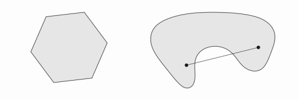
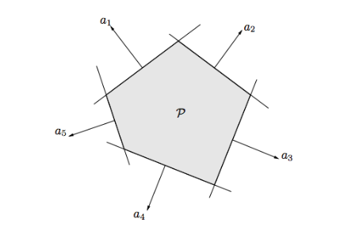
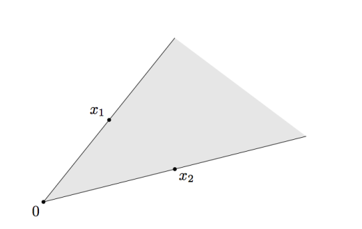
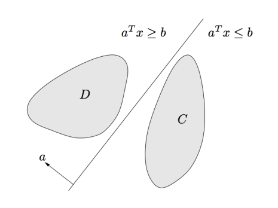
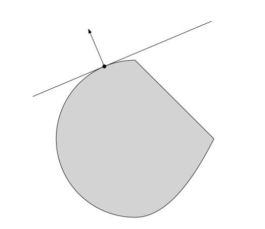
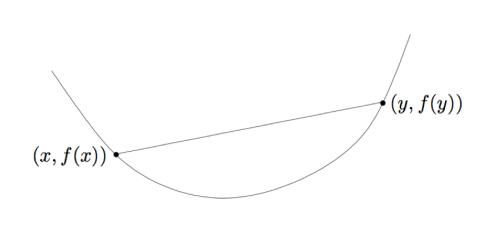
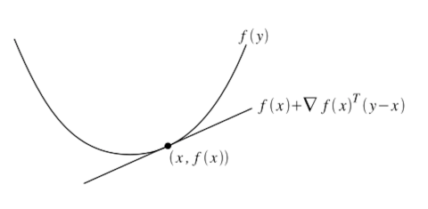

# 凸集与凸函数

> 主要内容包括: 凸集与凸函数的定义、性质、运算操作和例子，softmax函数是凸函数。

## 凸集

### 定义

凸集: $$C \in {\cal R}^n$$ 是一个凸集如果$$ x, y \in {\cal C} \Rightarrow tx + (1-t)y \in {\cal C}, 其中 0 \leq t \leq 1.$$ 

换句话说，在集合内任意两个元素连接成的直线上的点也在该集合内，这样的集合叫做凸集。

上图中，左边的集合是凸集，而右边的集合不是。

**凸组合**： $${\mit x_1,..., x_k \in R^n}$$ 的凸组合是一个任意的线性组合
$$
\theta_1x_1+...+\theta_kx_k
$$
其中 $$\theta_i \geq 0 , i = 1, ..., k,$$而且$$\sum_{i=1}^k \theta_i = 1$$

**凸包**：集合$${\cal C}$$的凸包$${\cal conv(C)}$$,是集合中元素的所有凸组合。一个凸包总是凸的，但是集合$${\cal C}$$不需要是凸的。

### 凸集的例子

- 特定的集合（Trivial）: 空集， 点，线
- 范数球(Norm ball): $$\{ x: \left\| x\right\| \leq r \}$$， 对于给定范数$$\left\| \cdot \right\|$$, 半径$${\cal r}$$
- 超平面（Hyperplane）: $$\{x:a^Tx=b\},\ for\ given\ a\ ,b.$$
- 半空间（Halfspace): $$\{x:a^Tx \leq b\}$$
- 放射空间（Affine space):$$\{x: Ax = b\},\ for\ given\ a\ , b.$$
- 多面体（Polyhedron):$$\{x: Ax \leq b\}$$

- 单面（simplex)

### 锥（Cones）

#### 定义

**Cone**是一个集合$${\mit C \subseteq R^n}$$满足：
$$
x \in C \Rightarrow tx \in C\ for\ all\ t \geq 0
$$

**Convex cone**是一个凸的锥，例如：
$$
x_1, x_2 \in C \Rightarrow t_1x_1 + t_2x_2 \in C\ for\ all\ t_1, t_2 \geq 0
$$
凸锥的实例如下图所示:

**锥组合**： $${\mit x_1,..., x_k \in R^n}$$ 的凸组合是一个任意的线性组合：
$$
\theta_1x_1+...+\theta_kx_k
$$
其中 $$\theta_i \geq 0 , i = 1, ..., k$$。

**锥包**（Conic hull):是所有锥组合的集合：$$\{\sum_i\theta_ix_i: \theta \in R_+^k\}$$

#### 凸锥的例子

- Norm cone: $$\{(x,t):\left\| x \right\| \leq t\}$$,当这个范数是使用的2范数$$\left\| \cdot \right\|_2\$$的时候，被称为**second-order cone**.

- Normal cone: 给定集合C与点$$x \in C$$，可以定义:
$$
{\cal N_C(x)} = \{g: g^Tx \geq g^Ty, for\ all\ y \in C\}
$$

满足该定义的点的集合都是Normal cone,其含义是指在normal cone中的点与集合C内的点的内积永远大于集合C内任意点与x的内积。

- Positive semidefinite cone: $$S_+^n = \{ X \in S^n: X\geq 0\}$$--正半定锥

- **Positive semidefinite**: 一个矩阵X是正半定的当X的所有特征值都大于等于0 $$\Leftrightarrow \ a^TXa \geq 0\ for\ all\ a \in R^n$$。

### 凸集的主要性质

凸集有两个重要的性质，这对于机器学习中的分类问题(如SVM)来说，在理论上起着支撑作用。

1. 分隔超平面理论（Separating hyperplane theorem）:两个不相交的凸集之间存在一个分割超平面。一个正式定义是：如果C、D是非空的凸集，且$$C\cap D=\emptyset$$，那么存在a,b使得：
$$
C \subseteq \{x:a^Tx \leq b\}\\
D \subseteq \{x:a^Tx \geq b\}
$$
如下图所示:

2. 支撑超平面理论（Supporting hyperplane theorem):如果C是一个非空的凸集，而且$$x_0 \in {\mit boundary(C)}$$，那么存在一个a使得：
$$
C \subseteq \{x: a^Tx \leq a^Tx_0\}
$$

### 保存凸性质的操作

* **交（intersection)**:凸集的交集依然是凸集。
* **Scaling and translation**: 如果C是凸集，那么$$aC + b = \{ax + b:x \in C\} $$也是凸集，对于任意的a,b。
* **Affine images and preimages**: 如过$$f(x)=Ax+b$$和$$C$$是凸的，那么$$f(X) = \{f(x):x\in C\}$$
也是凸集；如果$$D$$是凸集那么$$f^{-1}(D) = \{x:f(x) \in D\}$$也是凸集。

---

## 凸函数

### 定义

凸函数: $$ f : {\cal R^n } \rightarrow {\cal R}$$是凸函数如果$${\mit dom(f)} \subseteq {\cal R^n } 是凸的,且f(tx + (1-t)y) \leq tf(x) + (1-t)f(y), 其中 0 \leq t \leq 1.$$

如图所示，f总是在$$（x,f(x)), (y,f(y))$$的直线连线的下方。

凹函数与凸函数有着相反的定义，我们可以推出：
$$
f\ concave \Leftrightarrow -f\ convex
$$

凸函数有两个重要的分类（修饰符）：

- 严格凸性质（Strictly convex）: 这意味着$$f(tx + (1-t)y) \le tf(x) + (1-t)f(y), for\ 0 \leq t \leq 1$$对于$$x \not= y\ and\ 0 \le t \le 1.$$换句话说，f是凸函数而且曲率比线性函数大。

- 强凸性质（Strongly convex）:有参数$$m \ge 0$$使得$$f - \frac{m}{2}\left\|x\right\|_2^2$$是凸函数。也就是，f至少像二次函数一样的凸函数。

**$$强凸性质 \Rightarrow 严格凸性质 \Rightarrow 凸性质$$**，例如函数$$f(x) =1/x$$是严格凸的，但是不是强凸性的。

### 凸函数的例子

- 单变量函数
 * 指数函数
 * 幂函数
 $$
 \begin{eqnarray}
 x^a = \begin{cases}
 convex, &a \geq 1\ or\ a \leq 0\cr concave, &0 \leq a \leq 1\end{cases}
 \end{eqnarray},在{\cal R_+}上
 $$
 * 对数函数（$$\log x$$在$${\cal R_{++}}$$上是凹的。）
- 仿射函数: $$a^Tx+b$$既是凹的也是凸的。
- 二次函数: $$\frac{1}{2}x^TQx + b^Tx + c$$是凸函数如果$$Q \geq 0$$
- 最小二乘损失：$$\left\|y-Ax\right\|_2^2$$总是凸函数，因为$$A^TA$$总是正半定的。
- 范数$$\left\|x\right\|$$是凸函数（任何范数）
- 指示函数（indicator function):如果C是凸集，那么它的指示函数
$$
\begin{eqnarray}
I_C(x)=\begin{cases}
0,&x \in C\cr \infty, &x \notin C \end{cases} 
\end{eqnarray}
$$
也是凸函数。
- 支撑函数（support function）：对于任意集合C(不论是否是凸集)，它的支撑函数$$i_C^*(x) = \underset{y \in C}{max}\ x^Ty$$是凸函数
- 最大函数$$f(x) = max\{x_1, \cdots,x_n\}$$是凸函数。

### 凸函数的主要性质

**Epigraph characterization**:一个函数是凸函数当且应当其epigraph是凸集，其中epigraph被定义为：
$$
epi(f) = \{(x,t) \in dom(f) \times R: f(x) \leq t\}
$$
简单的说，epigraph是函数图像上方的点的集合。

**Convex sublevel sets**:如果f是凸函数，那么它次层集合$$\{x \in dom(f): f(x) \leq t\}$$也是凸的，对于所有的$$t \in {\mit R}$$。反之则不成立。

**First-order characterization**:如果f是可微的，那么f的凸函数当且仅当dom(f)是凸的，且$$f(y) \geq f(x) + \nabla f(x)^T(yx)\ for\ all\ x,y \in dom(f)$$。也就是说，**f必须在它的切线超平面上方**。因此，对于一个可微的f, x最小化f当且仅当$$\nabla f(x) = 0$$。

**Second-order characterization**:如果f是二次可微的，那么f是凸函数当且dom(f)是凸集。而且它的**Hessian矩阵**$$\nabla^2 f(x) \geq 0\ for\ all\ x\ \in dom(f)$$。

**Jensens inequality**:如果f是凸函数，而且X是f的定义域上的一个随机变量，则$$f(E[X]) \geq E[f(X)]$$。

### 保存凸函数性质的操作

- 非负的线性组合

- pointwise maximization：定义一个新的函数f(x)在x的值为有限可数的凸函数在x处的最大值，则f为凸函数，这意味着我们总能以逐点的方式最大化一系列函数。

- partial minimization：如果$$g(x, y)$$在x, y上是凸函数，而且C是一个凸集，那么在凸集C上的任意变量上局部最小化函数也是凸函数，如$$f(x)=min_{y \in C} g(x,y) 和 f(y) = min_{x \in C} g(x,y)$$

- 仿射组合：如果f是凸函数，那么$$g(x)=f(Ax+b)$$也是凸函数。

- General composition:$$f(x)=h(g(x))$$是凸函数当：外层函数h：$$R \rightarrow R$$是单调的，且内层函数g:$$R^n \rightarrow R$$是凹函数或者凸函数。
  - f是凸函数，如果h是凸函数且不单减，g是凸函数
  - f是凸函数，如果h是凸函数且不单增，g是凹函数
  - f是凹函数，如果h是凸函数且不单减，g是凹函数
  - f是凸函数，如果h是凸函数且不单增，g是凹函数

- 向量组合：与general composition相似，不过是逐点的形式。

### 例子：Softmax函数

Log-sum-exp（LSM）函数是：
$$
g(x) = \log(\sum_{i=1}^k exp(a_i^Tx + b_i))
$$
对于固定的$$a_i和b_i$$。

Log-sum-exp是凸函数，是严格单调递增的函数，但是并不是具有**严格凸性质**的。log-sum-exp可以选出平滑的最大值，利用切线逼近$$\log(X+a) \approx \log X +a/X$$，如果某一项$$x_j$$比其他的所有项都大：
$$
LSE(x) = \log(\sum_i exp\ x_j) \approx \log(exp\ x_j) + (\sum_{i \neq j} exp\ x_i)/exp\ x_j \approx x_j = max_i\ x_i
$$

$$x = (x_1, \cdots, x_n)$$，则偏导数是：
$$
\frac{\partial}{\partial x_i} LSE(x) = \frac{exp\ x_j}{\sum_j exp\ x_j}
$$
用梯度表示偏导数作为向量，可以得到**softmax函数**，一个在机器学习中被广为应用的函数。

话说回来，为什么log-sum-exp是凸函数呢？

由于仿射组合会保存凸性质，所有只要证明$$f(x) = \log(\sum_{i=1}^k exp(x_i))$$是凸函数就可以了。通过f(x)的二阶性质我们可以证明其凸性质:
$$
\nabla_i f(x) = \frac{e^{x_i}}{\sum_{l=1}^n e^{x_l}}
$$

$$
\nabla_{ij}^2 f(x) = \frac{e^{x_i}}{\sum_{l=1}^n e^{x_l}}1\{i=j\} - \frac{e^{x_i}e^{x_j}}{(\sum_{l=1}^n e^{x_l})^2}
$$
（我也不知道这个二阶导是怎么求的。数学堪忧。。）

重写前一个公式有$$\nabla^2 f(x)= diag(z) - zz^T$$，其中$$z_i = e^{x_i}/(\sum_{l=1}^n e^{x_l})$$，这个矩阵是**严格对角占优**的，所以是正半定的（p.s.d）,根据凸函数的二阶性质，f(x)是凸的。

### 例子：函数$$max\{\log \big (\frac{1}{(a^Tx+b)^7}\big ), \left\|Ax+b\right\|_1^5\}$$是凸函数吗？

在这个课程中，还讲了这样一个例子，上述函数是凸函数吗？

答案是是凸函数，它可以通过凸函数的性质与保存凸函数性质的操作得到。

