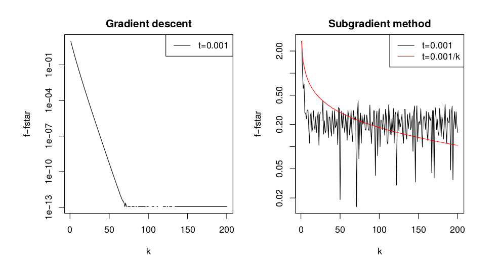
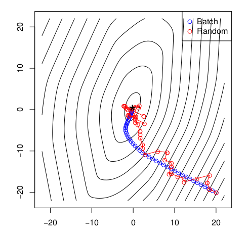

# 次梯度算法

> 本文内容包括：次梯度，次微分，次梯度算法

## 次梯度（Subgradients）

凸函数$$f：\mathbb{R}^n \rightarrow \mathbb{R}$$的次梯度：存在任意值$$g in \mathbb{R}^n$$使得：
$$
f(y) \geq f(x) + g^T(y - x), \forall y
$$
凸函数在不可微时，次梯度可以看做是梯度的一种泛化。除了一些病态条件，凸函数的次梯度总是存在的。对于非凸函数而言，即使上述定义满足，次梯度也可能不存在。
$$
f\ differentiable\ at\ x \Rightarrow g = \nabla f(x)[唯一的]
$$

### 次微分（Subdifferentials）

次微分$$\partial f(x)$$是凸函数f在x点处的次梯度的集合：
$$
\partial f(x) = \{g \in \mathbb{R}^n: g\ is\ a\ subgradient\ of\ f\ at\ x\ \}
$$
次微分具有如下的性质：

- $$\partial f(x)$$是封闭的凸集；
- $$\partial f(x)$$是非空的（如果是非凸函数，则可以为空）；
- 如果f在x处是可微的，则$$\partial = \{ \nabla f(x)\}$$；
- 如果$$\partial f(x) = \{g\}$$,那么f在x是可微的，$$\nabla f(x) = g$$。

### 次梯度性质

对于一个凸集$$C \in \mathbb{R}^n$$，它的指示函数(Indicator function)$$I_C: \mathbb{R}^n \rightarrow \mathbb{R}$$:
$$
\begin{equation}
I_C(x)=I\{ x \in C \}=
\begin{cases}
0 \quad & if \, x \in C\\
\infty \quad & if \, x \notin C
\end{cases}
\end{equation}
$$

**定理**:对于$$x \in C,\ \partial I_C(x) = \cal{N}_C(x)$$，其中$$\cal{N}_C(x)$$是C在x点的normal cone:$$\cal{N}_C(x)=\{g \in \mathbb{R}^n:g^Tx \geq g^Ty\ \forall y \in C\}$$

*证明*：
- 对于$$y \in C$$，由于normal cone的性质，$$g^Tx \geq g^Ty$$，则$$0 \geq g^T(y-x)$$，又因为$$I_C(y) = 0$$，因此$$I_C(y) \geq g^T(y-x)$$
- 对于$$y \notin C$$，$$I_C(y) = \infty \gt g^T(y - x)$$,(因为$$g^T(y - x)$$是有限的)，不满normal cone的定义。

凸函数的次微分具有以下的计算特性：

- Scaling: 在$$a \gt 0$$时, $$\partial (af) = a \cdot \partial f$$。如果$$a \lt 0$$，假设f 是凸函数，那么af 是凹函数，这个等式就不再成立。
- Addition: $$\partial (f_1 + f_2) = \partial f_1 + \partial f_2$$
- Affine composition: 如果$$g(x) = f(Ax+b)$$,那么$$\partial g(x) = A^T \partial f(Ax+b)$$。
- Finite pointwise maximum: 如果$$f(x) = \max_{i=1,\cdots,m} f_i(x)$$，则
$$
\partial f(x) = conv \left(\bigcup_{i:f_i(x)=f(x)}\partial f_i(x)\right)
$$
即$$\partial f(x)$$是所有有效函数（达到最大值的函数）的次微分集合的凸包，意味着函数f(x)在点x的次微分等于能够取得最大值的函数在该点处的微分。
- General pointwise maximum: 如果$$f(x) = \max_{s\in S} f_s(x)$$，则
$$
\partial f(x) \supseteq cl \left\{ conv \left( \bigcup_{s:f_s(x)=f(x)} \partial f_s(x)\right) \right\}
$$
- Norms:使$$p,q \gt 0,\ \frac{1}{p} + \frac{1}{q} = 1$$。考虑有$$f(x) = \left\|x\right\|_p$$，其中$$\left\|x\right\|_p$$被定义为：$$\left\|x\right\|_p = \max_{\left\|z\right\|_1 \leq 1} z^Tx$$，那么$$\partial f(x) = argmax_{\left\|z\right\|_1 \leq 1} z^Tx$$。

### 为什么要用次梯度

当目标函数光滑可微的时候，我们选择使用梯度下降算法，但事实上，并不是所有的目标函数都是光滑，或者处处可微的。如果能够计算次梯度，那么几乎能最小化任何凸函数（可能会很慢，但是是可能的）。

次梯度的**优化条件**(subgradient optimality condition):对于任意的函数f(不管是否是凸函数)，如果$$x^*$$是最优解当且仅当0属于f在$$x^*$$的次梯度的集合：
$$
f(x^*) = \min_x f(x) \Leftrightarrow 0 \in \partial f(x^*)
$$
证明如下：
$$
f(x^*) = min_x f(x) \Leftrightarrow f(y) \geq f(x^*) \forall y \Leftrightarrow f(y) \geq f(x^*) + 0^T(y-x^*)\forall y \Leftrightarrow 0 \in \partial f(x^*)
$$

如果f是凸函数且是可微的，那么，次梯度优化条件和凸函数的**一阶最优性**相同。

## 次梯度算法(Subgradient Method)

与梯度下降算法相似，将梯度替换成次梯度就是次梯度算法.
$$
x^(k) = x^{(k-1)} -t_kg^{(k-1)},\ k=1,2,3,\cdots
$$
其中$$g^{k-1} \in \partial f(x^{(k-1)})$$，是在$$x^{k-1}$$处的次梯度。这个算法**不**一定是下降的(不一定单调)。

### 步长选择

- 固定步长：对于所有步长，$$t_k = t$$。

- 逐渐变小的步长：选择满足如下条件的步长：
$$
\sum_{k=1}^\infty t_k^2 \lt \infty,\ \sum_{k=1}^\infty t_k = \infty
$$

### 收敛性分析

在前面提到，算法并不是一定是下降的，**那么为什么它一定能收敛呢？**

如果函数是Lipschitz连续的,$$G \gt 0$$，即对于所有x,y,$$f(x) - f(y) \le G\left\|x-y\right\|_2$$。

**定理**：对于一个固定步长t，次梯度算法满足：
$$
\lim_{k \rightarrow \infty} f(x_{best}^{(k)}) \le f^* + G^2t/2
$$
对于一个逐渐变小的步长，次梯度算法满足：
$$
\lim_{k \rightarrow \infty} f(x_{best}^{(k)}) = f^*
$$

/* TODO:证明以后来填坑 */

#### 收敛率

次梯度算法的收敛率为$$O(1/\epsilon^2)$$,与梯度下降算法的收敛率$$O(1/\epsilon)$$相比，慢了很多。 

### 随机次梯度算法（stochastic subgradient method）

与梯度下降算法的设定相同，考虑凸函数：
$$
\min_x \sum_{i=1}^m f_i(x)
$$

随机次梯度算法迭代：
$$
x^{(k)} = x^{(k-1)} - t_k\cdot g_{ik}^{(k-1)},\ k=1,2,3,\cdots
$$

其中$$i_k \in \{1, \cdots, m\}$$是在第k次迭代的选择的索引，通过*随机*或者*循环*的规则选择，且$$g_i^{(k-1)} \in \partial f_i(x^{(k-1)})$$。当每一个$$f_i$$是可微的，这个算法就变成了随机梯度下降算法。

同样随机次梯度算法是可以证明其收敛性和收敛率的。

### 例子：逻辑回归

给定$$(x_i, y_i) \in \mathbb{R}^p \times \{0,1\}$$,对于$$i = 1, \cdots, n$$,逻辑回归的损失函数为：
$$
f(\beta) = \sum_{i=1}^n \left( -y_i x_i^T \beta + \log(1+ exp(x_i^T \beta)\right)
$$

这是一个光滑的凸函数：
$$
\nabla f(\beta) = \sum_{i=1}^n \left( y_i - p_i(\beta)\right) x_i
$$

其中$$p_i(\beta) = exp(x_i^T\beta)/(1+ exp(x_i^T \beta)),\ i = 1, \cdots, n$$

#### 正则化

正则化的逻辑回归的损失函数为：
$$
\min \limits_{\beta \in \mathbb{R}^p} f(\beta) + \lambda \cdot P(\beta)
$$

如果$$P(\beta) = \left\| \beta\right\|_2^2$$，我们称之为岭回归（ridge penalty）；如果$$P(\beta) = \left\|\beta\right\|_1$$,我们称之为lasso回归（lasso penalty）,对于岭回归，我们可以采用梯度下降算法求解；而对于Lasso问题就需要选择次梯度算法来求解了。下图数据样本n=1000, p=20,左图用岭回归，梯度下降算法，右图用lasso回归，用次梯度算法：

#### 随机梯度下降

利用SGD算法来求解逻辑回归问题，随机梯度下降与batch梯度下降：

- batch梯度下降时间复杂度：$$O(np)$$

- stochastic梯度下降时间复杂度：$$O(p)$$

所以利用随机下降的方法在处理很大批量的数据的时候速度更快，而且前期的表现要好一点，但是后期在最优值处会更加震荡。一张经典的图片可以说明这一点：

